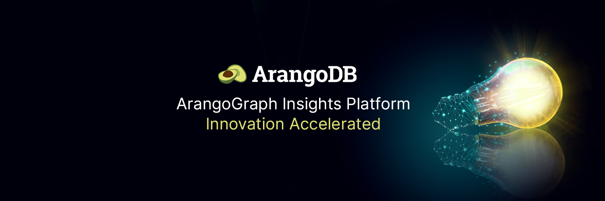

# The ArangoDB Cloud

The ArangoGraph Platform is the easiest way to run ArangoDB in the cloud.

**Getting started**

Take ArangoGraph for a free 14-day test ride on [dashboard.arangodb.cloud](https://dashboard.arangodb.cloud/home). No credit card required.

**FAQ**

View the [FAQ](https://dashboard.arangodb.cloud/faq) for answers to common questions about ArangoGraph.

**Fully Managed & Supported**

Experience the power and fractional TCO of a fully-managed cloud database, providing seamless native support for multiple data models, including graph, document, search, and key-value. Unleash the potential of diverse data in a single, fully-managed database deployment. Choose from a variety of support plans to meet your needs.

**Run Anywhere**

Ensure that your graph data is available with minimal effort by your operations team. Featuring Multi-availability Zone Clusters, Managed Zero-downtime Upgrades, Managed Backups, One-Click Disaster Recovery, Monitoring & Alerting and Managed Log Management.

**Highly Secure**

Encryption at transit & at rest guarantee all your data is encrypted before it hits the disk or sent over the network. In addition, you can assign fine-grained role-based access control (RBAC) policies to your organization, your projects or deployments. This assigns permissions to groups or individual users.

**Elastic Scale & Multi-Tenancy**

Elastically scale with all deployment models (OneShard & Sharded Clusters) and use the special ArangoDB Enterprise features for efficient queries on distributed data. Avoid costly vertical scaling of competing solutions and rely on ArangoGraph’s seamless horizontal scaling.

**High Availability**

Ensure that your graph data is available with minimal effort by your operations team. Featuring Multi-availability Zone Clusters, Managed Zero-downtime Upgrades, Managed Backups, One-Click Disaster Recovery, Monitoring & Alerting and Managed Log Management.